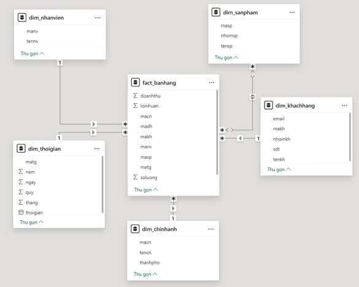

# 📊 Dự án Xây dựng Kho Dữ liệu Đám mây và Phân tích Kinh doanh 

Dự án này hướng đến việc thiết kế và triển khai **kho dữ liệu hiện đại trên nền tảng AWS**, kết hợp với các phương pháp phân tích và dự báo nhằm hỗ trợ ra quyết định nhanh chóng và hiệu quả cho Công ty TNHH Thương mại & Dịch vụ TSG.

---

## 🎯 Mục tiêu dự án

1. Phân tích và đánh giá hiện trạng hệ thống lưu trữ và khai thác dữ liệu của doanh nghiệp
2. Thiết kế và triển khai **kho dữ liệu trên nền tảng AWS** (S3, Glue, Redshift)
3. Ứng dụng các kỹ thuật khai phá dữ liệu như **Apriori, FP-Growth, RFM, K-means**
4. Trực quan hóa dữ liệu với **Power BI** và dự báo doanh thu bằng mô hình **Prophet**

---

## 📌 Đối tượng và phạm vi nghiên cứu

- **Đối tượng nghiên cứu**: Hệ thống kho dữ liệu sử dụng dịch vụ AWS (S3, Glue, Redshift), các thuật toán phân tích dữ liệu, công cụ Power BI
- **Phạm vi nghiên cứu**: Hoạt động dữ liệu tại Công ty TSG trong giai đoạn **01/2022 – 12/2024**

---

## 🔬 Phương pháp nghiên cứu

### 1. Khảo sát hệ thống hiện tại
Phân tích dữ liệu đầu vào, luồng xử lý, cấu trúc lưu trữ và hạn chế của hệ thống cũ  
📷 *(Chèn ảnh sơ đồ hệ thống cũ nếu có)*

---

### 2. Thiết kế mô hình dữ liệu

- Mô hình dữ liệu **Star Schema** gồm các bảng Fact và Dimension:
  - `fact_banhang`: doanh thu, lợi nhuận, số lượng bán
  - `dim_sanpham`, `dim_khachhang`, `dim_nhanvien`, `dim_thoigian`, `dim_chinhanh`

📷 *Hình ảnh mô hình dữ liệu (ERD):*

---

### 3. Triển khai pipeline ETL trên AWS

- **Amazon S3**: lưu trữ dữ liệu gốc
- **AWS Glue**: xử lý, làm sạch và chuyển đổi dữ liệu
- **Amazon Redshift**: lưu trữ dữ liệu đã xử lý phục vụ Power BI

📷 *Ảnh cấu hình lịch chạy ETL định kỳ từ Glue → Redshift:*

---

### 4. Thiết kế báo cáo BI trên Power BI

- Báo cáo tổng quan doanh thu
- Phân tích theo **chi nhánh**, **sản phẩm**, **khách hàng**, **nhân viên**
- Cập nhật tự động từ Redshift theo lịch định kỳ

📷 *Chèn ảnh một số dashboard BI (Power BI)*

---

### 5. Dự báo doanh thu bằng Prophet

- Dự báo doanh thu theo **từng nhóm sản phẩm**
- Dữ liệu được xử lý từ Redshift, mô hình Prophet triển khai bằng Python

📷 *Ảnh đồ thị dự báo doanh thu nhóm sản phẩm*

---

### 6. Phân tích hành vi khách hàng (luật kết hợp)

- Sử dụng **FP-Growth và Apriori**
- Phát hiện các bộ sản phẩm thường được mua cùng

📷 *Chèn ảnh biểu đồ luật kết hợp, hoặc bảng luật hỗ trợ quyết định bán chéo*

---

### 7. Phân khúc khách hàng bằng RFM + K-means

- Dựa vào độ mới (Recency), tần suất (Frequency), giá trị (Monetary)
- Kết quả chia thành 4 nhóm: trung thành, tiềm năng, mới, ít tương tác

## 📁 Cấu trúc thư mục dự án
Datawarehouse-Analytics/
│
├── Analytics/                     # Notebook Jupyter phân tích dữ liệu
│   ├── Association rules.ipynb
│   ├── Customer segmentation.ipynb
│   └── Revenue Forecast.ipynb
│
├── Assets/                        # Ảnh minh họa
│
├── Data model/                    # File tạo mô hình dữ liệu
│   └── starschema.sql
│
├── Document/                      # Tài liệu kỹ thuật
│   ├── Phân quyền truy cập cho BI User trên Power BI Service.docx
│   └── Quy trình triển khai kho dữ liệu.docx
│
├── Sample Data/                   # Dữ liệu mẫu
│
└── README.md

